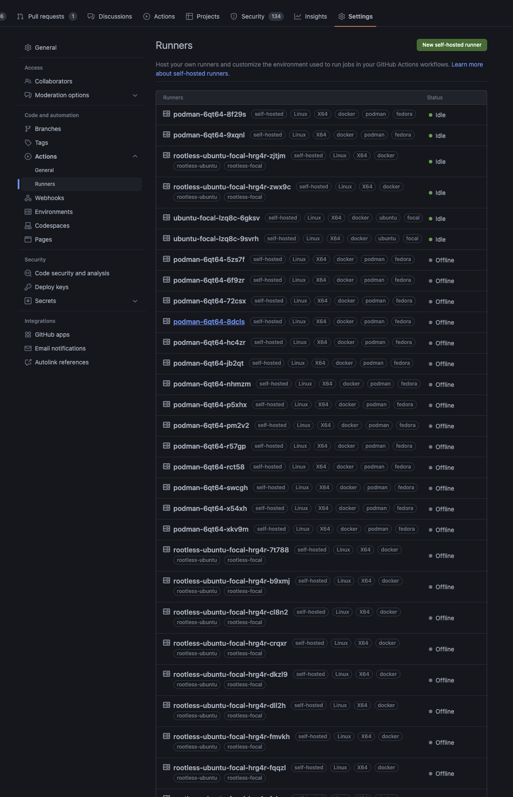

# Runner reaper for self-hosted GitHub Actions Runners

This is a quick GitHub Action that leverages the API to forcefully unregister all offline self-hosted runners.

> **Warning**
> As you'd expect, this Action force-removes all offline self-hosted runners in the scope provided!  It does _not_ actually do anything to the runners (VMs, bare metal boxes, etc).  This is useful if the runners are ephemeral containers and no longer exist.

## Usage

Input

- scope
- PAT (defined as a secret if scope is org or enterprise)
- scope name - repo name, org name, enterprise slug

## Why?

If/when self-hosted runners don't unregister themselves nicely, it gets ugly.  As someone who works with ephemeral self-hosted runners, when I start testing new images out, I end up with a bunch of "offline" runners that no longer exist to unregister.  There's no GUI way I've found to remove all offline runners _en masse_, and given my terrible allergy to manual click-through-boxes work, my repositories with self-hosted runners look like :point_down: pretty fast.

